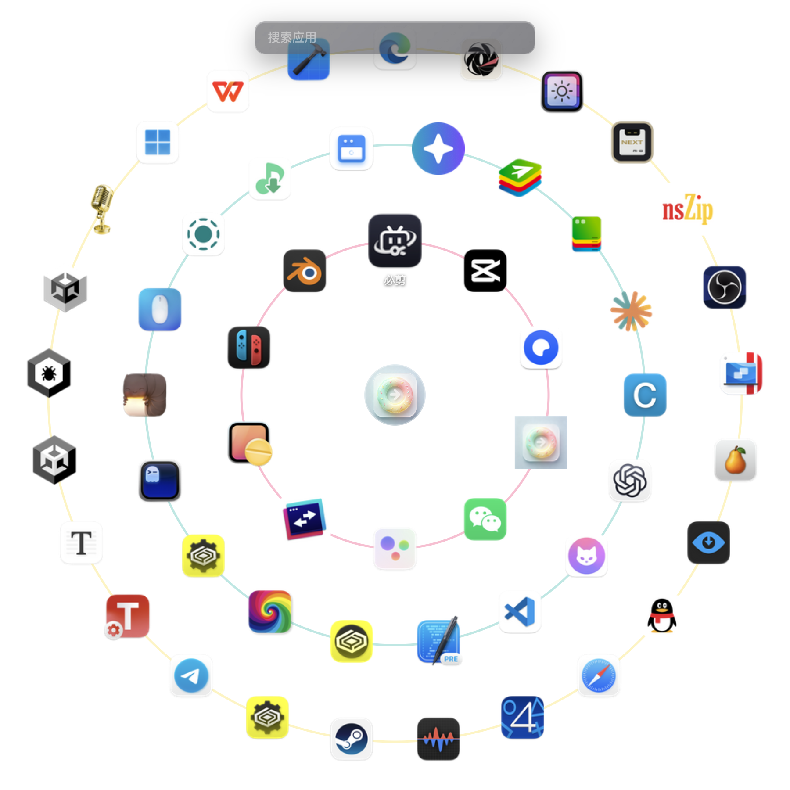

<div align="center">

# 甜甜圈启动台 (Donut Launcher)

macOS / Windows 圆形应用启动器 · Tauri + Vue 3


</div>

<p align="center">
  
</p>

## 简介

甜甜圈启动台（Donut Launcher）是一个面向 macOS 与 Windows 的圆形应用启动器：应用图标沿同心圆环排列，启动后直接显示，输入文字实时搜索，回车启动应用。项目基于 Tauri 2 + Vue 3 构建，前端界面由 SVG 绘制，支持无边框透明窗口、托盘菜单、收藏与隐藏应用、多页分页，以及一套完整的可视化设置面板。

macOS 上启动台默认扫描系统应用目录 `/System/Applications`、`/Applications` 和 `~/Applications`，递归查找 `.app` 应用包，解析 `Info.plist` 与中文本地化名称，并提取应用图标做磁盘缓存。Windows 上扫描开始菜单快捷方式（`.lnk`），通过 Shell 解析获取内置应用（UWP）的图标与中文名称。所有设置通过 Rust 后端持久化，退出后再次打开会恢复上次的圆环颜色、排序方式、开机自启动状态和自定义快捷键。

> 当前项目处于早期开发阶段，界面、设置项与内部接口可能随版本调整。

## 功能特性

- **环形布局**：根据应用数量自动生成同心圆环，最多三圈（每圈 10/18/26 个图标）；窗口尺寸随应用数量、当前显示器空间动态调整
- **多页分页**：超过三圈容量的应用自动分页，底部显示页指示点；触摸板双指左右滑动或按 `Tab` / `Shift+Tab` 切换分页
- **翻页动画**：切换分页时圆心图片沿纵轴左右翻转 360°，左侧翻入用向左翻转、右侧翻入用向右翻转
- **全局快捷键**：默认 `Option+Space`（macOS）/ `Alt+Space`（Windows）唤出/隐藏，可在设置面板中录制新的快捷键
- **实时搜索**：输入即过滤，80ms 防抖；同时匹配应用英文原名与中文显示名；呼出搜索框自动获得焦点
- **键盘/鼠标操作**：方向键移动选中项，`Enter` 启动，`Esc` 隐藏；鼠标悬停显示应用名，点击直接启动
- **收藏与隐藏**：图标右上角星标收藏、左上角 `×` 隐藏应用；设置页可取消隐藏
- **缓慢旋转**：圆环默认缓慢旋转，鼠标悬停时自动暂停，图标本体保持水平
- **中文友好**：macOS 优先读取 `InfoPlist.strings` 中的本地化名称，Windows 内置应用中英映射表，并按 `zh-CN` 排序
- **系统应用**：macOS 默认扫描 `/System/Applications`，Windows 自动扫描开始菜单并解析 UWP 内置应用图标
- **图标处理**：macOS 提取 `.icns` 内嵌 PNG，Windows 解析 `.lnk` 目标并通过 Shell 提取图标，64px 缓存到磁盘
- **托盘常驻**：菜单栏/系统托盘提供显示/隐藏、打开设置、退出；窗口失焦自动隐藏，后台保持运行
- **开机自启动**：设置面板可开启「开机自动启动」，登录系统时自动运行（macOS LaunchAgent / Windows 注册表）
- **多显示器**：窗口始终出现在光标所在显示器的工作区中央
- **设置持久化**：圆环颜色、透明度、粗细、旋转速度、图标大小、排序方式、扫描路径等全部可配置

## 快速开始

### 环境要求

- macOS 10.13+ 或 Windows 10+（建议使用较新系统）
- [Node.js](https://nodejs.org/) 20+（开发环境使用 Node 24）
- [pnpm](https://pnpm.io/) 11+
- [Rust](https://www.rust-lang.org/)（Tauri 2 需要）

### 安装与启动

```bash
pnpm install
pnpm dev
```

macOS 首次启动会扫描 `/System/Applications`、`/Applications` 和 `~/Applications`，Windows 首次启动会扫描开始菜单，随后直接显示启动台界面，应用常驻后台。此后启动应用即直接显示，按全局快捷键唤出/隐藏，点击圆心的甜甜圈打开设置，通过托盘菜单可以显示/隐藏窗口、打开设置或退出。

### 常用命令

| 命令 | 说明 |
| --- | --- |
| `pnpm dev` / `pnpm start` | 启动 Tauri 开发应用 |
| `pnpm build` / `pnpm tauri:build` | 构建 Tauri 安装包（macOS DMG / Windows NSIS） |
| `pnpm web:dev` | 启动 Vue 3 + Vite 开发服务器（浏览器中自动使用 mock 数据） |
| `pnpm web:build` | 类型检查并构建前端到 `dist/` |
| `pnpm test` | 运行前端 vitest 与 Rust 单元测试 |
| `pnpm test:web` | 运行 Vue 层 vitest 单元测试 |
| `pnpm test:rust` | 运行 Rust 后端单元测试 |
| `pnpm verify` | 运行 Playwright 界面冒烟测试 |

## 使用指南

### 唤起与隐藏

- 启动应用后窗口直接显示；之后按全局快捷键（macOS 默认 `Option+Space`，Windows 默认 `Alt+Space`）在显示与隐藏之间切换
- 点击托盘图标也可切换；从托盘菜单可打开设置或退出
- 窗口失焦后自动隐藏

### 选择与启动

- 鼠标悬停图标会显示应用名，点击直接启动
- 方向键移动选中项，`Enter` 启动当前项，`Esc` 隐藏窗口
- 启动应用后窗口自动隐藏，并在“最近使用”中记录时间

### 分页浏览

- 单页最多三圈（54 个图标），超过后自动分页，底部圆点指示当前页
- 触摸板双指左右滑动切换分页（一次滑动最多翻一页）
- 按 `Tab` 进下一页、`Shift+Tab` 进上一页
- 切换分页时圆心图片沿纵轴翻转，形成翻页动画

### 搜索

- 按 `Command+F`（macOS）/ `Ctrl+F`（Windows）显示或隐藏搜索框，呼出后自动获得焦点
- 显示搜索框后输入文字即可实时过滤应用
- 支持应用原名（如 `Books`）和中文显示名（如 `图书`）搜索
- 隐藏窗口后搜索词会自动清空

### 收藏与隐藏应用

- 悬停图标后点击右上角星标收藏；再次点击取消收藏
- 悬停图标后点击左上角 `×` 隐藏该应用
- 在设置面板“应用”页可以逐个取消隐藏，或一键取消全部隐藏

### 设置面板

设置面板包含四个页签：

**启动**

- 录制全局快捷键
- 开启/关闭开机自动启动
- 选择圆心图片（支持任意本地图片）或恢复默认甜甜圈图
- 调整圆心图片大小

**外观**

- 调整圆环透明度、粗细、旋转速度与选中放大比例
- 使用预设色、自定义 HSL/Hex 颜色添加圆环颜色，拖动色块调整顺序
- 开关缓慢旋转
- 选择排序方式：名称、最近使用、收藏优先

**应用**

- 查看默认扫描路径（macOS 含系统应用目录）
- 添加/移除自定义扫描目录
- 管理已隐藏应用
- 手动刷新应用列表

**关于**

- 查看软件版本与基本说明
- 手动或自动检查 GitHub 最新发布版本，可关闭自动检查
- 打开 GitHub 项目仓库与 B站 UP「在下练习两年的坤」主页

## 数据存储

设置、日志与应用图标缓存均保存在 Tauri 应用数据目录中，目录名基于应用标识符。开发模式下 macOS 的默认位置：

```text
~/Library/Application Support/com.github.oneincase.DonutLauncher/
├── settings.json      # 应用设置
├── icon-cache/        # 应用图标磁盘缓存
└── logs/              # 运行日志
```

Windows 的默认位置为 `%APPDATA%\com.github.oneincase.DonutLauncher\`（打包安装版可能使用 `%APPDATA%\DonutLauncher\`）。

主要设置项：

| 设置项 | 默认值 | 说明 |
| --- | --- | --- |
| `scanPaths` | `['/System/Applications', '/Applications', '~/Applications']` | 应用扫描目录（macOS；Windows 自动扫描开始菜单） |
| `ringColors` | `['#FF6B9D', '#4ECDC4', '#FFE66D']` | 圆环颜色列表 |
| `ringOpacity` | `0.45` | 圆环透明度 |
| `ringStrokeWidth` | `2` | 圆环粗细 |
| `shortcut` | `Option+Space`（macOS）/ `Alt+Space`（Windows） | 全局快捷键 |
| `centerIconPath` | `''` | 自定义圆心图片，空表示使用默认图片 |
| `centerIconSize` | `56` | 圆心图片大小 |
| `enableRotation` | `true` | 是否缓慢旋转 |
| `rotationSpeed` | `1` | 旋转速度（0-3） |
| `iconScale` | `1.25` | 选中/悬停图标放大比例 |
| `targetFps` | `60` | 动画帧率限制：`0` 为无限制，常用 30/60/120 |
| `autoCheckUpdate` | `true` | 启动时自动检查 GitHub 新版本 |
| `autoLaunch` | `false` | 登录系统时是否自动启动 |
| `favorites` | `[]` | 收藏应用 id 列表 |
| `sortMode` | `name` | 排序方式：`name` / `recent` / `favorites` |
| `recentUsage` | `{}` | 应用最近使用时间记录 |
| `excludedApps` | `[]` | 隐藏的应用名列表 |

## 项目结构

```text
.
├── src-tauri/                   # Rust 后端
│   ├── src/
│   │   ├── main.rs              # 入口与 Tauri 命令注册
│   │   ├── commands.rs          # 前端可调用的 Tauri 命令
│   │   ├── scanner.rs           # 应用扫描、plist/lnk 解析、图标提取与缓存
│   │   ├── settings.rs          # 设置持久化
│   │   ├── window.rs            # 窗口创建、显示/隐藏与尺寸调整
│   │   ├── tray.rs              # 托盘图标与菜单
│   │   └── shortcut.rs          # 全局快捷键注册
│   ├── Cargo.toml
│   └── tauri.conf.json
├── src/ui/                      # Vue 3 + TypeScript 前端
│   ├── App.vue
│   ├── main.ts
│   ├── stores/                  # Pinia 状态
│   ├── components/              # UI 组件（含设置面板各页签）
│   ├── lib/                     # 布局、分页、颜色、列表工具
│   ├── services/                # Tauri API 封装与 mock
│   └── ...
├── src/public/                  # 内置资源（默认圆心图片等）
├── tests/e2e/                   # Playwright 测试
├── docs/
│   └── screenshot.png           # README 示例截图
├── package.json
├── vite.config.ts
├── vitest.config.ts
├── playwright.config.ts
├── pnpm-workspace.yaml
├── LICENSE
└── README.md
```

## 架构说明

### 前后端划分

- **Rust 后端（`src-tauri/src`）**：负责窗口管理、全局快捷键、托盘、开机自启动、应用扫描、应用启动、设置持久化和日志
- **Vue 3 前端（`src/ui`）**：负责应用列表渲染、环形布局与分页计算、SVG 绘制、键盘/鼠标/触摸板交互、翻页动画与设置面板

### 主要流程

1. Rust 后端按平台扫描应用：macOS 读取 `Info.plist` 与本地化名称并提取 `.icns` 图标；Windows 解析开始菜单 `.lnk` 快捷方式并通过 Shell 提取图标
2. 前端通过 Tauri 命令获取应用列表，使用 `donut-layout.ts` 计算图标坐标、`paginateApps` 分页并渲染
3. 用户选择应用后，Rust 后端启动应用、记录最近使用并隐藏窗口
4. 设置变更通过 Tauri 命令写入磁盘；快捷键与开机自启动变化会立即生效

### Tauri 命令

| 命令 | 说明 |
| --- | --- |
| `get_apps` | 获取应用列表（首次调用触发扫描） |
| `refresh_apps` | 重新扫描应用 |
| `launch_app` | 启动应用并记录最近使用 |
| `get_settings` / `set_settings` | 读取/写入设置 |
| `reset_settings` | 恢复默认设置 |
| `pick_folder` | 选择自定义扫描目录 |

### 事件

| 事件 | 方向 | 说明 |
| --- | --- | --- |
| `show` / `hide` | backend -> frontend | 窗口显示/隐藏事件 |
| `open-settings` | backend -> frontend | 打开设置面板事件 |
| `shortcut-error` | backend -> frontend | 全局快捷键注册失败提示 |

### 环形布局与分页

布局算法集中在 `src/ui/lib/donut-layout.ts` 中，纯函数实现、便于单元测试：

- 基础视口为 720x720；第一圈容纳 10 个图标，之后每圈递增 8 个（10/18/26），**最多三圈**
- 内圈半径 52，圈间距 88；窗口尺寸为布局视口的 1.25 倍，最小 900x900，并留出屏幕边距
- 单页上限 54 个图标；超过后由 `paginateApps` 切片分页，窗口尺寸封顶在三圈大小
- 奇数圈自动错开半个步进角，避免图标在相邻圈之间排成直线
- 分页状态由 Pinia store 管理，触摸板滑动（带防跳页锁定）与 `Tab` / `Shift+Tab` 均可切换

## 开发与测试

### 单元测试

```bash
pnpm test
```

前端测试使用 [Vitest](https://vitest.dev/)，覆盖环形布局边界（含三圈上限、分页切片与越界钳制）、应用过滤与排序、颜色处理与快捷键解析等逻辑。Rust 后端测试使用 `cargo test`，覆盖应用扫描（macOS 含系统应用目录）、设置序列化与命令边界。

### 界面测试

```bash
pnpm verify
```

使用 Playwright 在 Chromium 中打开前端开发服务器，对环形渲染、搜索框、设置面板等进行冒烟测试。

### 打包发布

```bash
pnpm build
```

Tauri 会构建前端并打包当前平台的安装包。macOS 默认输出未签名的 DMG（产物名为 `DonutLauncher`），Windows 默认输出未签名的 NSIS 安装程序。

推送以 `v*` 开头的标签到 GitHub 后，仓库里的 `Release Tauri` 工作流会自动在 macOS（arm64 + x86_64）与 Windows 上构建并发布到 GitHub Releases。

macOS 打开未签名应用时若被 Gatekeeper 拦截，可右键选择“打开”，或执行：

```bash
xattr -dr com.apple.quarantine "/path/to/DonutLauncher-*.dmg"
```

## 常见问题

**快捷键无法使用？**

全局快捷键可能被系统、输入法或其他应用占用。设置面板会提示注册失败，可尝试 `Option+Shift+Space` 或 `Command+Option+Space`（macOS）/ `Alt+Shift+Space` 或 `Ctrl+Alt+Space`（Windows），也可以在设置中录制其他组合。

**找不到某些应用？**

macOS 默认扫描 `/System/Applications`、`/Applications` 和 `~/Applications`（含系统应用），Windows 默认扫描开始菜单。若应用安装在其他目录，可在设置面板“应用”页添加自定义扫描目录，或点击“刷新应用”。扫描目录会与默认目录合并去重。

**忘记快捷键且无法唤出窗口？**

通过托盘菜单打开设置，或删除 Tauri 应用数据目录下的 `settings.json` 恢复默认设置。

**为什么后台仍有进程？**

启动台需要常驻以响应全局快捷键和托盘操作；隐藏窗口后前端不再占用资源，仅保留 Rust 后端进程。

## 贡献

欢迎提交 Issue、Pull Request 或改进建议。开发时请保持现有风格：

- 前端使用 Vue 3 + TypeScript，优先组合式 API
- 布局与列表逻辑尽量写成纯函数，便于单元测试
- 修改行为时同步补充或更新 `*.test.ts` / `*.rs` 测试
- 提交前运行 `pnpm test`，涉及界面渲染时运行 `pnpm verify`

## 开源协议

本项目基于 [Apache License 2.0](LICENSE) 开源。提交贡献即视为同意按该协议授权。

启动台展示的应用图标版权归各应用所有者所有，本项目仅在本机运行时读取并展示，不随源码分发任何第三方应用图标。

### 致谢

感谢以下开源项目提供的支持：[Tauri](https://tauri.app/)、[Vue.js](https://vuejs.org/)、[Vite](https://vitejs.dev/)、[Rust](https://www.rust-lang.org/) 与 [Tauri Actions](https://github.com/tauri-apps/tauri-action)。
